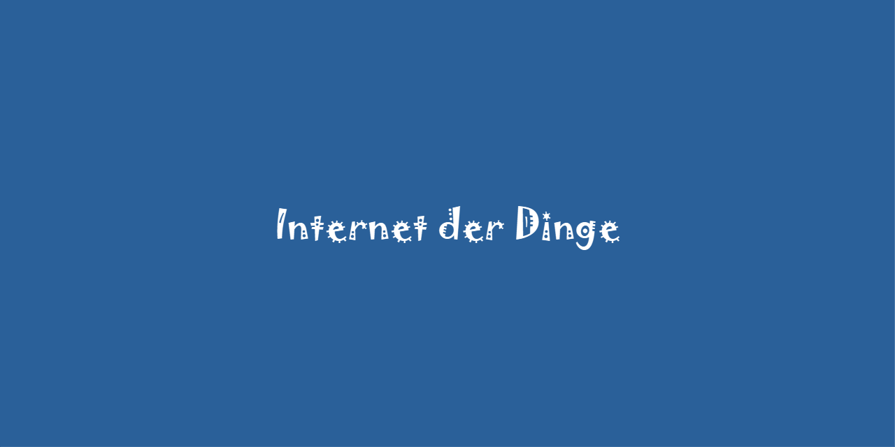

# Kurs Internet der Dinge

Dieses Repository enthält Unterlagen zum Kurs **Internet der Dinge**, der an der [Fakultät für Technik und angewandte Naturwissenschaften](https://fh-ooe.at/campus-wels) der [Fachhochschule Oberösterreich](https://fh-ooe.at/) für Teilnehmer*innen in den Master-Studiengängen [Automatisierungstechnik](https://fh-ooe.at/studienangebot/automatisierungstechnik-master) und [Robotic Systems Engineering](https://fh-ooe.at/studienangebot/robotic-systems-engineering-master) unterrichtet wird.

## Quellen

Das Repository enthält Quellcode für Gerätesoftware, welcher mit der Programmiersprache C# und für die IoT-Platform Thingsboard geschrieben ist.

### ⚙️ [Firmware 1](./Quellen/Firmware_1/)

Die *erste Version* der Firmware enthält die folgenden Funktionen:

* Konfigurationsdaten von der IoT-Plattform an das IoT-Gateway über HTTP
* Telemetriedaten vom IoT-Gateway an die IoT-Plattform über HTTP

Die folgende Grafik zeigt die Architektur der Firmware als Flussdiagramm:

### ⚙️ [Firmware 2](./Quellen/Firmware_2/)

Die *zweite Version* der Firmware enthält die folgenden Funktionen:

* Konfigurationsdaten von der IoT-Plattform an das IoT-Gateway über MQTT
* Telemetriedaten vom IoT-Gateway an die IoT-Plattform über MQTT

Die folgende Grafik zeigt die Architektur der Firmware als Flussdiagramm:

### ⚙️ [Firmware 3](./Quellen/Firmware_3/)

Die *dritte Version* der Firmware enthält die folgenden Funktionen:

* Konfigurationsdaten von der IoT-Plattform an das IoT-Gateway über MQTT
* Telemetriedaten von einer Steuerung an das IoT-Gateway über Modbus TCP
* Telemetriedaten vom IoT-Gateway an die IoT-Plattform über MQTT
* Firmwaredaten von der IoT-Plattform an das IoT-Gateway über MQTT
* Neustart der Firmware auf dem IoT-Gateway nach erfolgreicher Übertragung

Die folgende Grafik zeigt die Architektur der Firmware als Flussdiagramm:

## Dokumente

Hier sind noch drei wichtige Dokumente, die du dir vor und während der Nutzung dieses Repositories gut durchlesen solltest:

* [Änderungen](./CHANGELOG.md)
* [Beitragen](./CONTRIBUTING.md)
* [Lizenz](./LICENSE.md)